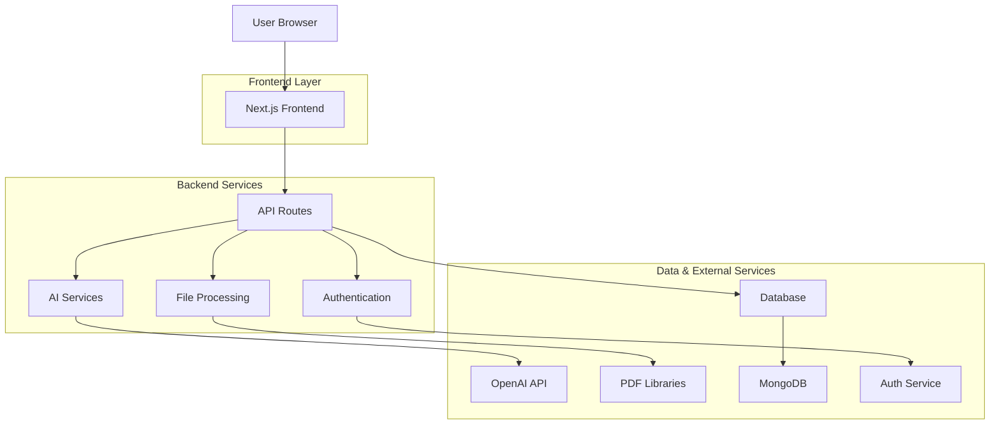

# Quix Editor - Product Documentation

## 1. Product Overview

Quix Editor is an AI-powered learning and course creation ecosystem designed to revolutionize how educators and content creators build engaging educational experiences. The platform combines intuitive visual editing with advanced AI capabilities to dramatically reduce course creation time while enhancing content quality and interactivity.

**Core Value Proposition**: Transform static educational materials into dynamic, interactive courses 10x faster using AI-powered content generation, intelligent structuring, and collaborative tools.

**Market Position**: Positioned as the leading AI-first course creation platform for educators, replacing traditional LMS content builders with an intelligent, block-based approach that adapts to modern learning needs.

## 2. Target Users

### Primary Users
- **Teachers & Educators**: K-12 teachers, university professors, corporate trainers
- **Content Creators**: Educational YouTubers, course creators, training consultants
- **Instructional Designers**: Corporate learning teams, curriculum developers

### User Segmentation
| User Type | Primary Need | Technical Skill | Usage Frequency |
|-----------|--------------|-----------------|-----------------|
| K-12 Teachers | Quick lesson creation | Low-Medium | Daily |
| University Professors | Research-based content | Medium-High | Weekly |
| Corporate Trainers | Professional development | Medium | Monthly |
| Content Creators | Engaging multimedia | High | Daily |

## 3. Core Features

### 3.1 Visual Course Builder
**Block-Based Editing System**
- Drag-and-drop content blocks (text, images, videos, quizzes)
- Real-time collaborative editing with conflict resolution
- Version history with rollback capabilities
- Responsive design preview for multiple devices

**Content Block Types**:
- Text blocks with rich formatting
- Image galleries with captions
- Video embeds (YouTube, Vimeo, local uploads)
- Interactive quizzes and assessments
- Code snippets with syntax highlighting
- Mathematical equations (LaTeX support)
- Audio recordings and podcasts

### 3.2 AI Content Assistant
**Intelligent Content Generation**
- Auto-generate course outlines from topics
- Expand bullet points into detailed explanations
- Create engaging introductions and summaries
- Generate relevant examples and case studies
- Adapt content difficulty based on target audience

**Smart Content Enhancement**
- Auto-suggest related content blocks
- Improve text readability and engagement
- Generate alt-text for images
- Create transcripts for audio/video content
- Translate content to multiple languages

### 3.3 Document Processing
**Multi-Format Support**
- PDF upload and text extraction
- Word document processing
- PowerPoint slide conversion
- Image OCR and text recognition
- Video/audio transcription

**Intelligent Structuring**
- Auto-detect document structure (chapters, sections)
- Convert static content to interactive blocks
- Extract key concepts and create summaries
- Generate visual aids from text descriptions

### 3.4 Assessment Generation
**Auto-Quiz Creation**
- Generate multiple choice questions from content
- Create true/false statements
- Build fill-in-the-blank exercises
- Design short answer questions
- Create matching exercises

**Adaptive Learning**
- Difficulty progression based on performance
- Personalized question banks
- Instant feedback and explanations
- Progress tracking and analytics

### 3.5 Publishing & Distribution
**Multi-Platform Publishing**
- Export to SCORM packages
- LMS integration (Canvas, Blackboard, Moodle)
- Web-based course hosting
- Mobile app compatibility
- Print-friendly PDF generation

**Access Control**
- Public and private course settings
- Enrollment management
- Password protection
- Time-limited access
- User progress tracking

### 3.6 Collaboration Features
**Team Collaboration**
- Real-time multi-user editing
- Comment and suggestion system
- Role-based permissions (viewer, editor, admin)
- Review and approval workflows
- Change notifications and alerts

**Community Features**
- Course template sharing
- Peer review system
- Rating and feedback mechanism
- Collaborative course libraries
- Expert consultation marketplace

## 4. User Stories

### 4.1 Teacher Creates Course from Scratch
**Scenario**: Sarah, a high school biology teacher, needs to create a course on photosynthesis for her 10th-grade students.

**Journey**:
1. **Login**: Sarah accesses Quix Editor with her school credentials
2. **New Course**: Clicks "Create New Course" and selects "Science" category
3. **AI Assistance**: Types "Photosynthesis for 10th grade" in AI assistant
4. **Outline Generation**: AI generates comprehensive course outline with 5 modules
5. **Content Creation**: Uses drag-and-drop to add text blocks, images, and videos
6. **Quiz Integration**: AI auto-generates 10 quiz questions from her content
7. **Preview**: Reviews course in student view mode
8. **Publish**: Publishes to her school's Canvas LMS with one click

**Outcome**: Complete interactive course created in 2 hours instead of 2 days

### 4.2 Teacher Uploads PDF for AI Processing
**Scenario**: Michael, a university professor, has a 50-page research paper he wants to convert into a course module.

**Journey**:
1. **Upload**: Drags PDF into Quix Editor upload area
2. **Processing**: AI analyzes document structure and extracts key concepts
3. **Structure Detection**: AI identifies 8 main sections and 23 subsections
4. **Content Conversion**: Converts dense text into digestible learning blocks
5. **Enhancement**: AI suggests adding diagrams and interactive elements
6. **Review**: Michael reviews and adjusts AI-generated content
7. **Supplement**: Adds his own insights and custom examples
8. **Finalize**: Completes course module with 3 hours of work

**Outcome**: Transforms static research into engaging multimedia course content

### 4.3 Teacher Collaborates with Colleagues
**Scenario**: Lisa and her 3 department colleagues need to create a comprehensive algebra curriculum.

**Journey**:
1. **Team Setup**: Lisa creates team workspace and invites colleagues
2. **Role Assignment**: Assigns different modules to each team member
3. **Parallel Work**: Team works simultaneously on different course sections
4. **Real-time Sync**: Changes appear instantly for all collaborators
5. **Comment System**: Team leaves feedback and suggestions on specific blocks
6. **Review Cycle**: Iterative review and improvement process
7. **Approval Workflow**: Department head reviews and approves final content
8. **Launch**: Coordinated launch across all algebra classes

**Outcome**: 4-person team creates semester-long curriculum in 1 week

### 4.4 Teacher Publishes Course for Students
**Scenario**: James wants to publish his history course and track student engagement.

**Journey**:
1. **Final Review**: Completes content review and quality check
2. **Settings Configuration**: Sets course to private, enables progress tracking
3. **Enrollment Setup**: Creates enrollment codes for his 150 students
4. **Multi-Platform**: Publishes to web, mobile app, and school LMS
5. **Analytics Setup**: Enables detailed engagement tracking
6. **Student Communication**: Sends welcome message with course access instructions
7. **Monitoring**: Tracks student progress and identifies struggling students
8. **Iteration**: Updates content based on student feedback and performance

**Outcome**: Successfully engages 150 students with 85% completion rate

## 5. Technical Architecture

### 5.1 System Architecture


### 5.2 Frontend Architecture
**Technology Stack**:
- **Framework**: Next.js 14 with App Router
- **UI Library**: React 18 with TypeScript
- **Styling**: Tailwind CSS + Headless UI
- **State Management**: Zustand for global state, React Query for server state
- **Editor**: TipTap (ProseMirror-based) for rich text editing
- **Drag & Drop**: @dnd-kit for modern drag-and-drop
- **Real-time**: Socket.io for collaborative editing

**Component Structure**:
```
src/
├── components/
│   ├── editor/
│   │   ├── blocks/          # Content block components
│   │   ├── toolbar/         # Editor toolbar
│   │   └── sidebar/         # Left navigation panel
│   ├── ai/
│   │   ├── assistant/       # AI chat interface
│   │   └── suggestions/     # AI content suggestions
│   └── shared/
├── hooks/
├── utils/
└── types/
```

### 5.3 Backend Architecture
**API Routes Structure**:
```
app/api/
├── auth/           # Authentication endpoints
├── courses/        # Course management
├── content/        # Content block operations
├── ai/            # AI generation endpoints
├── files/         # File upload/processing
├── quizzes/       # Quiz generation
└── collaboration/ # Real-time collaboration
```

**Key Services**:
- **AI Service**: OpenAI API integration with prompt engineering
- **File Service**: Multi-format document processing
- **Quiz Service**: Intelligent question generation
- **Collaboration Service**: Real-time editing with operational transforms

## 6. UI/UX Design

### 6.1 Design System
**Color Palette**:
- Primary: #3B82F6 (Blue) - Main actions and CTAs
- Secondary: #8B5CF6 (Purple) - AI features and highlights
- Success: #10B981 (Green) - Positive feedback
- Warning: #F59E0B (Orange) - Important notices
- Error: #EF4444 (Red) - Errors and alerts
- Neutral: #6B7280 (Gray) - Secondary text and borders

**Typography**:
- Headings: Inter (Sans-serif) - Modern and readable
- Body: Inter (Sans-serif) - Consistent with headings
- Code: JetBrains Mono - Developer-friendly monospace

**Spacing System**:
- Base unit: 4px
- Scale: 4, 8, 12, 16, 24, 32, 48, 64px
- Consistent padding and margins throughout

### 6.2 Layout Design
**Three-Panel Layout**:
```
┌─────────────────────────────────────────────────────────────┐
│                    Top Navigation Bar                       │
├─────────────┬─────────────────────────┬─────────────────────┤
│             │                         │                     │
│   Left      │     Center Editor       │    Right AI Panel   │
│ Navigation  │     (Main Canvas)       │    (AI Assistant)   │
│ Panel       │                         │                     │
│             │                         │                     │
│ • Course    │ • Block-based editor    │ • AI chat interface  │
│   structure │ • Drag-and-drop         │ • Content          │
│ • Templates │ • Rich text editing     │   suggestions      │
│ • Assets    │ • Real-time preview     │ • Quick actions    │
│             │                         │ • Analytics        │
└─────────────┴─────────────────────────┴─────────────────────┘
```

**Responsive Breakpoints**:
- Desktop: 1280px+ (Full three-panel layout)
- Tablet: 768px-1279px (Collapsible side panels)
- Mobile: <768px (Single panel with navigation)

### 6.3 Interactive Elements
**Toolbar Design**:
- Floating toolbar for text formatting
- Contextual actions based on selected block
- AI action buttons with clear visual distinction
- Keyboard shortcuts for power users

**Block System**:
- Visual block boundaries with hover states
- Drag handles with clear affordance
- Block type icons for quick identification
- Inline editing with seamless transitions

## 7. API Specifications

### 7.1 AI Content Generation
**Generate Course Outline**
```
POST /api/ai/generate-outline
```
Request:
```json
{
  "topic": "Photosynthesis",
  "grade_level": "10th grade",
  "duration": "2 weeks",
  "learning_objectives": ["Understand photosynthesis process", "Identify key components"]
}
```
Response:
```json
{
  "outline": {
    "modules": [
      {
        "title": "Introduction to Photosynthesis",
        "duration": "2 days",
        "topics": ["Definition", "Importance", "Historical context"]
      }
    ]
  },
  "suggestions": ["Add interactive diagram", "Include lab experiment"]
}
```

**Expand Content**
```
POST /api/ai/expand-content
```
Request:
```json
{
  "content": "Photosynthesis converts light energy into chemical energy",
  "context": "High school biology",
  "expand_type": "detailed_explanation"
}
```

### 7.2 Course Management
**Create Course**
```
POST /api/courses
```
Request:
```json
{
  "title": "Photosynthesis Fundamentals",
  "description": "Comprehensive course on photosynthesis",
  "grade_level": "10th grade",
  "subject": "Biology",
  "duration": "2 weeks"
}
```

**Update Course Content**
```
PUT /api/courses/{courseId}/content
```
Request:
```json
{
  "blocks": [
    {
      "type": "text",
      "content": "Photosynthesis is...",
      "position": 1
    }
  ]
}
```

### 7.3 File Processing
**Upload Document**
```
POST /api/files/upload
```
Multipart form data with file upload
Response:
```json
{
  "file_id": "uuid",
  "filename": "document.pdf",
  "processed_content": {
    "text": "Extracted text content",
    "structure": {
      "chapters": [],
      "sections": []
    }
  }
}
```

### 7.4 Quiz Generation
**Generate Quiz**
```
POST /api/quizzes/generate
```
Request:
```json
{
  "content_id": "content_uuid",
  "question_types": ["multiple_choice", "true_false"],
  "question_count": 10,
  "difficulty": "medium"
}
```

## 8. Database Schema

### 8.1 Core Collections

**Users Collection**
```javascript
{
  _id: ObjectId,
  email: String,
  name: String,
  role: String, // 'teacher', 'admin', 'student'
  institution: String,
  preferences: {
    ai_assistance: Boolean,
    notifications: Object
  },
  created_at: Date,
  updated_at: Date
}
```

**Courses Collection**
```javascript
{
  _id: ObjectId,
  title: String,
  description: String,
  creator_id: ObjectId,
  collaborators: [{
    user_id: ObjectId,
    role: String, // 'viewer', 'editor', 'admin'
    permissions: [String]
  }],
  structure: {
    modules: [{
      id: String,
      title: String,
      description: String,
      order: Number
    }]
  },
  settings: {
    visibility: String, // 'private', 'public', 'institution'
    allow_comments: Boolean,
    enable_progress_tracking: Boolean
  },
  status: String, // 'draft', 'published', 'archived'
  created_at: Date,
  updated_at: Date
}
```

**Content Blocks Collection**
```javascript
{
  _id: ObjectId,
  course_id: ObjectId,
  module_id: String,
  type: String, // 'text', 'image', 'video', 'quiz', 'code'
  content: Object, // Type-specific content
  position: Number,
  settings: {
    visible: Boolean,
    interactive: Boolean,
    ai_generated: Boolean
  },
  metadata: {
    word_count: Number,
    reading_time: Number,
    difficulty: String
  },
  created_at: Date,
  updated_at: Date
}
```

**AI Interactions Collection**
```javascript
{
  _id: ObjectId,
  user_id: ObjectId,
  course_id: ObjectId,
  interaction_type: String, // 'outline_generation', 'content_expansion', 'quiz_generation'
  prompt: String,
  response: Object,
  tokens_used: Number,
  model: String,
  created_at: Date
}
```

### 8.2 Indexes
```javascript
// Performance optimization
db.courses.createIndex({ creator_id: 1, status: 1 })
db.content_blocks.createIndex({ course_id: 1, module_id: 1, position: 1 })
db.ai_interactions.createIndex({ user_id: 1, created_at: -1 })
db.collaborations.createIndex({ user_id: 1, role: 1 })
```

## 9. Integration Requirements

### 9.1 AI Services
**OpenAI Integration**
- GPT-4 for content generation and expansion
- DALL-E for image generation
- Whisper for audio transcription
- Fine-tuned models for educational content

**Configuration**:
```javascript
{
  api_key: process.env.OPENAI_API_KEY,
  models: {
    content_generation: "gpt-4",
    image_generation: "dall-e-3",
    transcription: "whisper-1"
  },
  rate_limits: {
    requests_per_minute: 60,
    tokens_per_minute: 90000
  }
}
```

### 9.2 File Processing
**PDF Processing Libraries**
- pdf-parse: Text extraction from PDFs
- pdf-lib: PDF manipulation and modification
- mammoth: Word document processing
- sharp: Image optimization and processing

**Media Processing**
- FFmpeg: Video/audio processing
- pydub: Audio manipulation
- opencv: Computer vision tasks

### 9.3 External APIs
**LMS Integration**
- Canvas API: Course publishing and grade sync
- Blackboard API: Content import/export
- Moodle API: Plugin integration
- Google Classroom: Assignment creation

**Storage Services**
- AWS S3: File storage and CDN
- Cloudinary: Image and video optimization
- MongoDB Atlas: Database hosting

## 10. Success Metrics

### 10.1 User Engagement Metrics
**Course Creation Efficiency**
- Average time to create 1-hour course content: Target < 2 hours
- AI assistance usage rate: Target > 80% of courses
- Template adoption rate: Target > 60% of new courses
- Content block reuse rate: Target > 40%

**User Retention**
- Monthly active users: Target 25% month-over-month growth
- User return rate: Target > 70% within 30 days
- Feature adoption rate: Target > 50% for core features
- User satisfaction score: Target > 4.5/5.0

### 10.2 Content Quality Metrics
**AI Performance**
- Content generation accuracy: Target > 90% user acceptance
- Time saved per course: Target > 60% reduction
- AI suggestion adoption: Target > 75%
- Error rate in generated content: Target < 5%

**Educational Impact**
- Student engagement rate: Target > 80% course completion
- Learning outcome improvement: Target > 20% better test scores
- Content accessibility score: Target > 95% compliance
- Multilingual support coverage: Target > 10 languages

### 10.3 Technical Performance
**System Reliability**
- Uptime: Target > 99.9%
- API response time: Target < 500ms average
- File processing speed: Target < 30 seconds for 50MB
- Real-time sync latency: Target < 100ms

**Scalability Metrics**
- Concurrent users: Support > 10,000 simultaneous
- Course storage: Support > 1 million courses
- File storage: Support > 100TB total
- AI processing: Handle > 100,000 requests/day

### 10.4 Business Metrics
**Growth Indicators**
- User acquisition cost: Target < $50 per user
- Customer lifetime value: Target > $500 per user
- Conversion rate (free to paid): Target > 15%
- Monthly recurring revenue: Target 30% month-over-month growth

**Market Penetration**
- Educational institutions served: Target > 1,000 in year 1
- Countries with active users: Target > 50
- Content languages supported: Target > 20
- Partnership integrations: Target > 25 major platforms

---

## Implementation Roadmap

### Phase 1: MVP (Months 1-3)
- Core editor with basic block types
- AI content generation for outlines and text
- Simple course publishing
- Basic user authentication

### Phase 2: Enhanced Features (Months 4-6)
- Advanced AI capabilities (quiz generation, content expansion)
- Document upload and processing
- Real-time collaboration
- LMS integrations

### Phase 3: Scale & Optimize (Months 7-9)
- Performance optimization
- Advanced analytics
- Mobile applications
- Enterprise features

### Phase 4: Market Expansion (Months 10-12)
- Internationalization
- Advanced AI models
- Partnership integrations
- Community features

This documentation serves as the comprehensive guide for developing Quix Editor into a world-class AI-powered educational platform that transforms how courses are created and delivered.