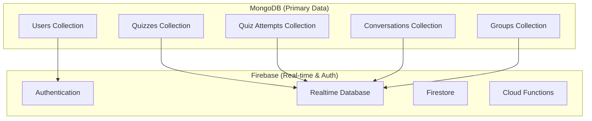

# 🗃️ Database Usage Guide

## 📋 Overview

This guide explains the existing database structure, data models, seeding processes, and innovative authentication flow between MongoDB and Firebase for the QuixPro educational platform.

---

## 🏗️ Database Architecture

### **Dual Database System**



---

## 📊 MongoDB Collections & Models

### **1. Users Collection**

```typescript
// Existing User Model Structure
interface User {
  _id: ObjectId;                    // MongoDB ObjectId
  email: string;                    // Primary identifier
  name: string;                     // Full name
  avatar?: string;                  // Profile picture URL
  role: 'student' | 'teacher' | 'admin';  // User role
  level: string;                    // Education level (P1-S6)
  school?: string;                  // School name
  points: number;                   // Current points
  streak: number;                   // Learning streak
  preferences?: {                   // User preferences
    theme: 'light' | 'dark';
    notifications: boolean;
    language: 'en' | 'rw' | 'fr';
  };
  gamification?: {                  // Gamification data
    level: number;
    achievements: Achievement[];
    badges: Badge[];
    totalPoints: number;
    monthlyPoints: number;
  };
  firebaseUid?: string;             // Firebase UID (for sync)
  createdAt: Date;                  // Account creation
  updatedAt: Date;                  // Last update
  lastActive?: Date;                // Last activity
}

// Example User Document
{
  "_id": "507f1f77bcf86cd799439011",
  "email": "student@school.rw",
  "name": "Jean Mugisha",
  "role": "student",
  "level": "S3",
  "school": "Kigali Secondary School",
  "points": 1250,
  "streak": 7,
  "firebaseUid": "firebase-uid-12345",
  "createdAt": "2024-01-15T10:30:00.000Z",
  "updatedAt": "2024-03-07T14:22:15.000Z"
}
```

### **2. Quizzes Collection**

```typescript
interface Quiz {
  _id: ObjectId;
  title: string;                     // Quiz title
  description: string;               // Quiz description
  subject: string;                   // Subject area
  difficulty: 'easy' | 'medium' | 'hard';
  duration: number;                  // Duration in minutes
  questions: Question[];             // Array of questions
  createdBy: ObjectId;               // Teacher who created it
  isPublic: boolean;                 // Public visibility
  tags: string[];                    // Subject tags
  category: string;                  // Quiz category
  attempts: number;                  // Total attempts
  averageScore: number;              // Average score
  createdAt: Date;
  updatedAt: Date;
}

interface Question {
  id: string;
  type: 'multiple_choice' | 'true_false' | 'fill_blank';
  text: string;                      // Question text
  options?: string[];                // Multiple choice options
  correctAnswer: string;             // Correct answer
  explanation?: string;              // Explanation
  points: number;                    // Question points
  media?: {                          // Media attachments
    type: 'image' | 'video' | 'audio';
    url: string;
  };
}
```

### **3. Quiz Attempts Collection**

```typescript
interface QuizAttempt {
  _id: ObjectId;
  userId: ObjectId;                   // Student who attempted
  quizId: ObjectId;                   // Quiz attempted
  score: number;                     // Score achieved
  totalQuestions: number;            // Total questions
  correctAnswers: number;            // Correct answers
  timeSpent: number;                 // Time spent in seconds
  answers: Answer[];                 // User's answers
  feedback?: {                        // Quiz feedback
    strengths: string[];
    improvements: string[];
    recommendations: string[];
  };
  completedAt: Date;                 // Completion time
  createdAt: Date;
}

interface Answer {
  questionId: string;
  userAnswer: string;
  correct: boolean;
  timeSpent: number;                 // Time per question
}
```

### **4. Conversations Collection**

```typescript
interface Conversation {
  _id: ObjectId;
  type: 'direct' | 'group';          // Conversation type
  participants: string[];            // Participant emails
  title?: string;                    // Group title
  description?: string;              // Group description
  createdBy: string;                 // Creator email
  lastMessage?: {                    // Last message preview
    content: string;
    sender: string;
    timestamp: Date;
  };
  unreadCount?: {                    // Unread messages per user
    [email]: number;
  };
  metadata?: {                        // Additional metadata
    isPublic: boolean;
    category: string;
    tags: string[];
  };
  createdAt: Date;
  updatedAt: Date;
}
```

### **5. Groups Collection**

```typescript
interface Group {
  _id: ObjectId;
  name: string;                       // Group name
  description: string;               // Group description
  createdBy: string;                 // Creator email
  members: GroupMember[];            // Group members
  isPublic: boolean;                 // Public visibility
  category: string;                  // Group category
  settings: {                        // Group settings
    allowInvites: boolean;
    requireApproval: boolean;
    maxMembers: number;
  };
  createdAt: Date;
  updatedAt: Date;
}

interface GroupMember {
  email: string;
  role: 'admin' | 'moderator' | 'member';
  joinedAt: Date;
}
```

---

## 🔥 Firebase Integration

### **Firebase Realtime Database Structure**

```json
{
  "users": {
    "user-email-hash": {
      "status": "online",
      "lastSeen": 1647123456789,
      "preferences": {
        "notifications": true,
        "theme": "dark"
      }
    }
  },
  "conversations": {
    "conversation-id": {
      "participants": ["email1@example.com", "email2@example.com"],
      "metadata": {
        "lastMessage": "Hello!",
        "lastMessageTime": 1647123456789,
        "unreadCount": {
          "email1@example.com": 2,
          "email2@example.com": 0
        }
      }
    }
  },
  "presence": {
    "user-email-hash": {
      "status": "online",
      "lastSeen": 1647123456789
    }
  },
  "typing": {
    "conversation-id": {
      "user-email-hash": true
    }
  }
}
```

### **Firebase Authentication Integration**

```typescript
// MongoDB to Firebase Authentication Sync
class AuthSyncService {
  async syncUserToFirebase(userEmail: string): Promise<string> {
    try {
      // 1. Find user in MongoDB
      const user = await User.findOne({ email: userEmail });
      if (!user) {
        throw new Error('User not found in MongoDB');
      }
      
      // 2. Check if Firebase user exists
      let firebaseUser;
      try {
        firebaseUser = await firebaseAdmin.auth().getUserByEmail(userEmail);
      } catch (error) {
        // User doesn't exist in Firebase, create one
        firebaseUser = await firebaseAdmin.auth().createUser({
          email: userEmail,
          emailVerified: true,
          displayName: user.name,
          disabled: false
        });
      }
      
      // 3. Set custom claims for role and level
      await firebaseAdmin.auth().setCustomUserClaims(firebaseUser.uid, {
        role: user.role,
        level: user.level,
        school: user.school,
        mongoId: user._id.toString()
      });
      
      // 4. Update MongoDB with Firebase UID
      await User.updateOne(
        { _id: user._id },
        { firebaseUid: firebaseUser.uid }
      );
      
      // 5. Create Firebase custom token
      const customToken = await firebaseAdmin.auth().createCustomToken(firebaseUser.uid);
      
      return customToken;
    } catch (error) {
      console.error('Firebase sync error:', error);
      throw error;
    }
  }
  
  async authenticateUser(email: string, password: string): Promise<AuthResult> {
    try {
      // 1. Authenticate against MongoDB
      const user = await User.findOne({ email });
      if (!user) {
        throw new Error('User not found');
      }
      
      // 2. Verify password (assuming bcrypt hash)
      const isPasswordValid = await bcrypt.compare(password, user.password);
      if (!isPasswordValid) {
        throw new Error('Invalid password');
      }
      
      // 3. Sync to Firebase and get custom token
      const firebaseToken = await this.syncUserToFirebase(email);
      
      // 4. Update last active timestamp
      await User.updateOne(
        { _id: user._id },
        { lastActive: new Date() }
      );
      
      return {
        user: {
          id: user._id.toString(),
          email: user.email,
          name: user.name,
          role: user.role,
          level: user.level,
          points: user.points,
          streak: user.streak
        },
        firebaseToken,
        expiresIn: 3600 // 1 hour
      };
    } catch (error) {
      console.error('Authentication error:', error);
      throw error;
    }
  }
}
```

---

## 🌱 Data Seeding Process

### **Database Seeder Implementation**

```typescript
// Database Seeder
class DatabaseSeeder {
  async seedAllData(): Promise<void> {
    console.log('🌱 Starting database seeding...');
    
    try {
      await this.seedUsers();
      await this.seedQuizzes();
      await this.seedGroups();
      await this.seedConversations();
      await this.seedQuizAttempts();
      
      console.log('✅ Database seeding completed successfully!');
    } catch (error) {
      console.error('❌ Database seeding failed:', error);
      throw error;
    }
  }
  
  private async seedUsers(): Promise<void> {
    console.log('👥 Seeding users...');
    
    const users = [
      {
        email: 'admin@quixpro.rw',
        name: 'Admin User',
        role: 'admin',
        level: 'S6',
        school: 'QuixPro Administration',
        points: 5000,
        streak: 30,
        password: await bcrypt.hash('admin123', 10)
      },
      {
        email: 'teacher@school.rw',
        name: 'Jeanne Mukamana',
        role: 'teacher',
        level: 'S6',
        school: 'Kigali Secondary School',
        points: 2500,
        streak: 15,
        password: await bcrypt.hash('teacher123', 10)
      },
      {
        email: 'student1@school.rw',
        name: 'Eric Niyonzima',
        role: 'student',
        level: 'S3',
        school: 'Kigali Secondary School',
        points: 850,
        streak: 7,
        password: await bcrypt.hash('student123', 10)
      },
      {
        email: 'student2@school.rw',
        name: 'Grace Uwimana',
        role: 'student',
        level: 'P5',
        school: 'Kigali Primary School',
        points: 620,
        streak: 5,
        password: await bcrypt.hash('student123', 10)
      }
    ];
    
    for (const userData of users) {
      await User.findOneAndUpdate(
        { email: userData.email },
        userData,
        { upsert: true, new: true }
      );
    }
  }
  
  private async seedQuizzes(): Promise<void> {
    console.log('📝 Seeding quizzes...');
    
    const quizzes = [
      {
        title: 'Mathematics: Basic Algebra',
        description: 'Introduction to algebraic expressions and equations',
        subject: 'Mathematics',
        difficulty: 'easy',
        duration: 20,
        questions: [
          {
            id: 'q1',
            type: 'multiple_choice',
            text: 'What is the value of x in the equation 2x + 5 = 15?',
            options: ['5', '10', '15', '20'],
            correctAnswer: '5',
            points: 10
          },
          {
            id: 'q2',
            type: 'multiple_choice',
            text: 'Simplify: 3x + 2x',
            options: ['5x', '6x', '3x²', '2x²'],
            correctAnswer: '5x',
            points: 10
          }
        ],
        createdBy: 'teacher@school.rw',
        isPublic: true,
        tags: ['algebra', 'equations', 'basic'],
        category: 'Mathematics'
      },
      {
        title: 'Science: Photosynthesis',
        description: 'Understanding the process of photosynthesis in plants',
        subject: 'Science',
        difficulty: 'medium',
        duration: 25,
        questions: [
          {
            id: 'q1',
            type: 'multiple_choice',
            text: 'What gas do plants produce during photosynthesis?',
            options: ['Oxygen', 'Carbon Dioxide', 'Nitrogen', 'Hydrogen'],
            correctAnswer: 'Oxygen',
            points: 15
          }
        ],
        createdBy: 'teacher@school.rw',
        isPublic: true,
        tags: ['biology', 'plants', 'photosynthesis'],
        category: 'Science'
      }
    ];
    
    for (const quizData of quizzes) {
      await Quiz.findOneAndUpdate(
        { title: quizData.title },
        quizData,
        { upsert: true, new: true }
      );
    }
  }
  
  private async seedGroups(): Promise<void> {
    console.log('👥 Seeding groups...');
    
    const groups = [
      {
        name: 'S3 Mathematics Study Group',
        description: 'Collaborative learning for S3 mathematics students',
        createdBy: 'teacher@school.rw',
        members: [
          { email: 'teacher@school.rw', role: 'admin', joinedAt: new Date() },
          { email: 'student1@school.rw', role: 'member', joinedAt: new Date() }
        ],
        isPublic: true,
        category: 'Study Groups',
        settings: {
          allowInvites: true,
          requireApproval: false,
          maxMembers: 50
        }
      },
      {
        name: 'Kigali Schools Network',
        description: 'Network for all students in Kigali schools',
        createdBy: 'admin@quixpro.rw',
        members: [
          { email: 'admin@quixpro.rw', role: 'admin', joinedAt: new Date() },
          { email: 'student1@school.rw', role: 'member', joinedAt: new Date() },
          { email: 'student2@school.rw', role: 'member', joinedAt: new Date() }
        ],
        isPublic: true,
        category: 'School Networks',
        settings: {
          allowInvites: true,
          requireApproval: false,
          maxMembers: 1000
        }
      }
    ];
    
    for (const groupData of groups) {
      await Group.findOneAndUpdate(
        { name: groupData.name },
        groupData,
        { upsert: true, new: true }
      );
    }
  }
  
  private async seedConversations(): Promise<void> {
    console.log('💬 Seeding conversations...');
    
    const conversations = [
      {
        type: 'direct',
        participants: ['teacher@school.rw', 'student1@school.rw'],
        lastMessage: {
          content: 'Great work on today\'s quiz!',
          sender: 'teacher@school.rw',
          timestamp: new Date()
        },
        unreadCount: {
          'student1@school.rw': 1
        }
      },
      {
        type: 'group',
        participants: ['teacher@school.rw', 'student1@school.rw', 'student2@school.rw'],
        title: 'S3 Mathematics Group',
        description: 'Discussion group for S3 mathematics students',
        createdBy: 'teacher@school.rw',
        lastMessage: {
          content: 'Welcome to our study group!',
          sender: 'teacher@school.rw',
          timestamp: new Date()
        }
      }
    ];
    
    for (const convData of conversations) {
      await Conversation.findOneAndUpdate(
        { participants: convData.participants },
        convData,
        { upsert: true, new: true }
      );
    }
  }
  
  private async seedQuizAttempts(): Promise<void> {
    console.log('📊 Seeding quiz attempts...');
    
    const attempts = [
      {
        userId: 'student1@school.rw',
        quizId: 'Mathematics: Basic Algebra',
        score: 85,
        totalQuestions: 2,
        correctAnswers: 2,
        timeSpent: 1200, // 20 minutes
        answers: [
          {
            questionId: 'q1',
            userAnswer: '5',
            correct: true,
            timeSpent: 300
          },
          {
            questionId: 'q2',
            userAnswer: '5x',
            correct: true,
            timeSpent: 900
          }
        ],
        feedback: {
          strengths: ['Excellent understanding of basic algebra'],
          improvements: ['Practice more complex equations'],
          recommendations: ['Try advanced algebra quiz']
        },
        completedAt: new Date()
      }
    ];
    
    for (const attemptData of attempts) {
      await QuizAttempt.create(attemptData);
    }
  }
}
```

### **Seeder Usage**

```typescript
// Run seeder
async function runSeeder() {
  const seeder = new DatabaseSeeder();
  await seeder.seedAllData();
}

// CLI command for seeding
if (require.main === module) {
  runSeeder().catch(console.error);
}
```

---

## 🔧 Database Operations

### **CRUD Operations**

```typescript
// User Operations
export class UserService {
  static async createUser(userData: Partial<User>): Promise<User> {
    const user = new User(userData);
    return await user.save();
  }
  
  static async getUserByEmail(email: string): Promise<User | null> {
    return await User.findOne({ email });
  }
  
  static async updateUserPoints(userId: string, points: number): Promise<User> {
    return await User.findByIdAndUpdate(
      userId,
      { 
        $inc: { points: points },
        $set: { updatedAt: new Date() }
      },
      { new: true }
    );
  }
  
  static async updateStreak(userId: string): Promise<User> {
    const user = await User.findById(userId);
    if (!user) throw new Error('User not found');
    
    const today = new Date().toDateString();
    const lastActive = user.lastActive?.toDateString();
    
    let newStreak = user.streak;
    if (lastActive !== today) {
      const yesterday = new Date();
      yesterday.setDate(yesterday.getDate() - 1);
      
      if (lastActive === yesterday.toDateString()) {
        newStreak += 1;
      } else {
        newStreak = 1;
      }
    }
    
    return await User.findByIdAndUpdate(
      userId,
      { 
        streak: newStreak,
        lastActive: new Date(),
        updatedAt: new Date()
      },
      { new: true }
    );
  }
}

// Quiz Operations
export class QuizService {
  static async createQuiz(quizData: Partial<Quiz>): Promise<Quiz> {
    const quiz = new Quiz(quizData);
    return await quiz.save();
  }
  
  static async getQuizzesBySubject(subject: string): Promise<Quiz[]> {
    return await Quiz.find({ subject, isPublic: true });
  }
  
  static async getQuizById(quizId: string): Promise<Quiz | null> {
    return await Quiz.findById(quizId);
  }
  
  static async updateQuizStats(quizId: string, score: number): Promise<Quiz> {
    return await Quiz.findByIdAndUpdate(
      quizId,
      { 
        $inc: { attempts: 1 },
        $set: { 
          averageScore: await this.calculateNewAverage(quizId, score),
          updatedAt: new Date()
        }
      },
      { new: true }
    );
  }
  
  private static async calculateNewAverage(quizId: string, newScore: number): Promise<number> {
    const quiz = await Quiz.findById(quizId);
    if (!quiz) return newScore;
    
    const totalScore = (quiz.averageScore * (quiz.attempts - 1)) + newScore;
    return Math.round(totalScore / quiz.attempts);
  }
}

// Quiz Attempt Operations
export class QuizAttemptService {
  static async createAttempt(attemptData: Partial<QuizAttempt>): Promise<QuizAttempt> {
    const attempt = new QuizAttempt(attemptData);
    const savedAttempt = await attempt.save();
    
    // Update quiz stats
    await QuizService.updateQuizStats(
      attemptData.quizId as string,
      attemptData.score as number
    );
    
    // Update user points
    const points = this.calculatePoints(attemptData.score as number, attemptData.totalQuestions as number);
    await UserService.updateUserPoints(attemptData.userId as string, points);
    
    return savedAttempt;
  }
  
  static async getUserAttempts(userId: string): Promise<QuizAttempt[]> {
    return await QuizAttempt.find({ userId }).sort({ completedAt: -1 });
  }
  
  static async getQuizAttempts(quizId: string): Promise<QuizAttempt[]> {
    return await QuizAttempt.find({ quizId }).sort({ completedAt: -1 });
  }
  
  private static calculatePoints(score: number, totalQuestions: number): number {
    const percentage = (score / totalQuestions) * 100;
    if (percentage >= 90) return 100;
    if (percentage >= 80) return 80;
    if (percentage >= 70) return 60;
    if (percentage >= 60) return 40;
    return 20;
  }
}
```

### **Firebase Real-time Operations**

```typescript
// Firebase Real-time Operations
export class FirebaseService {
  static async updateUserPresence(userEmail: string, status: 'online' | 'offline'): Promise<void> {
    const emailHash = this.hashEmail(userEmail);
    const presenceRef = firebaseAdmin.database().ref(`presence/${emailHash}`);
    
    await presenceRef.set({
      status,
      lastSeen: Date.now()
    });
  }
  
  static async sendTypingIndicator(conversationId: string, userEmail: string, isTyping: boolean): Promise<void> {
    const emailHash = this.hashEmail(userEmail);
    const typingRef = firebaseAdmin.database().ref(`typing/${conversationId}/${emailHash}`);
    
    if (isTyping) {
      await typingRef.set(true);
      // Auto-remove after 3 seconds
      setTimeout(() => typingRef.remove(), 3000);
    } else {
      await typingRef.remove();
    }
  }
  
  static async updateConversationMetadata(conversationId: string, metadata: any): Promise<void> {
    const conversationRef = firebaseAdmin.database().ref(`conversations/${conversationId}/metadata`);
    await conversationRef.update(metadata);
  }
  
  private static hashEmail(email: string): string {
    // Simple hash for Firebase keys
    return btoa(email).replace(/[^a-zA-Z0-9]/g, '');
  }
}
```

---

## 🔄 Data Sync Process

### **MongoDB to Firebase Sync**

```typescript
// Data Synchronization Service
export class DataSyncService {
  static async syncUserToFirebase(userEmail: string): Promise<void> {
    try {
      // 1. Get user from MongoDB
      const user = await User.findOne({ email: userEmail });
      if (!user) return;
      
      // 2. Sync to Firebase Realtime Database
      const emailHash = this.hashEmail(userEmail);
      const userRef = firebaseAdmin.database().ref(`users/${emailHash}`);
      
      await userRef.set({
        status: 'offline',
        lastSeen: Date.now(),
        preferences: user.preferences || {
          notifications: true,
          theme: 'light'
        },
        gamification: user.gamification || {
          level: 1,
          points: 0,
          streak: 0
        }
      });
      
      // 3. Update Firebase Authentication if needed
      if (!user.firebaseUid) {
        const firebaseUser = await firebaseAdmin.auth().createUser({
          email: user.email,
          displayName: user.name,
          emailVerified: true
        });
        
        await User.updateOne(
          { _id: user._id },
          { firebaseUid: firebaseUser.uid }
        );
      }
      
    } catch (error) {
      console.error('Firebase sync error:', error);
    }
  }
  
  static async syncConversationToFirebase(conversationId: string): Promise<void> {
    try {
      const conversation = await Conversation.findById(conversationId);
      if (!conversation) return;
      
      const convRef = firebaseAdmin.database().ref(`conversations/${conversationId}`);
      
      await convRef.set({
        participants: conversation.participants,
        metadata: {
          lastMessage: conversation.lastMessage,
          lastMessageTime: conversation.lastMessage?.timestamp || Date.now(),
          unreadCount: conversation.unreadCount || {}
        }
      });
      
    } catch (error) {
      console.error('Conversation sync error:', error);
    }
  }
  
  private static hashEmail(email: string): string {
    return btoa(email).replace(/[^a-zA-Z0-9]/g, '');
  }
}
```

---

## 🚀 Advanced Features

### **Innovative Email-Based Authentication**

```typescript
// Enhanced Authentication System
export class EnhancedAuthService {
  static async authenticateWithEmail(email: string, password?: string): Promise<AuthResult> {
    try {
      // 1. Check MongoDB for user
      const user = await User.findOne({ email });
      if (!user) {
        throw new Error('User not found');
      }
      
      // 2. Handle different auth methods
      let authResult;
      
      if (password) {
        // Email/Password authentication
        authResult = await this.authenticateWithPassword(user, password);
      } else {
        // Magic link / OTP authentication
        authResult = await this.authenticateWithMagicLink(user);
      }
      
      // 3. Sync to Firebase
      await DataSyncService.syncUserToFirebase(email);
      
      // 4. Update activity
      await User.updateOne(
        { _id: user._id },
        { lastActive: new Date() }
      );
      
      return authResult;
      
    } catch (error) {
      console.error('Authentication error:', error);
      throw error;
    }
  }
  
  private static async authenticateWithPassword(user: User, password: string): Promise<AuthResult> {
    const isPasswordValid = await bcrypt.compare(password, user.password);
    if (!isPasswordValid) {
      throw new Error('Invalid password');
    }
    
    return this.createAuthSession(user);
  }
  
  private static async authenticateWithMagicLink(user: User): Promise<AuthResult> {
    // Generate magic link token
    const token = jwt.sign(
      { email: user.email, type: 'magic_link' },
      process.env.NEXTAUTH_SECRET!,
      { expiresIn: '15m' }
    );
    
    // Send magic link email
    await this.sendMagicLinkEmail(user.email, token);
    
    return {
      user: this.sanitizeUser(user),
      message: 'Magic link sent to your email',
      requiresEmailVerification: true
    };
  }
  
  private static async createAuthSession(user: User): Promise<AuthResult> {
    // Create Firebase custom token
    const firebaseToken = await firebaseAdmin.auth().createCustomToken(user.firebaseUid || user._id.toString());
    
    return {
      user: this.sanitizeUser(user),
      firebaseToken,
      expiresIn: 3600
    };
  }
  
  private static sanitizeUser(user: User): any {
    return {
      id: user._id.toString(),
      email: user.email,
      name: user.name,
      role: user.role,
      level: user.level,
      points: user.points,
      streak: user.streak,
      gamification: user.gamification
    };
  }
}
```

---

## 📊 Analytics & Reporting

### **Database Analytics**

```typescript
// Analytics Service
export class AnalyticsService {
  static async getUserAnalytics(userId: string): Promise<UserAnalytics> {
    const user = await User.findById(userId);
    const attempts = await QuizAttempt.find({ userId });
    
    return {
      performance: {
        totalQuizzes: attempts.length,
        averageScore: this.calculateAverageScore(attempts),
        bestSubject: this.getBestSubject(attempts),
        improvementRate: this.calculateImprovementRate(attempts)
      },
      engagement: {
        totalTimeSpent: attempts.reduce((sum, a) => sum + a.timeSpent, 0),
        averageSessionLength: this.calculateAverageSessionLength(attempts),
        preferredStudyTimes: this.getPreferredStudyTimes(attempts),
        streakData: {
          current: user.streak,
          longest: user.gamification?.longestStreak || 0
        }
      },
      progress: {
        currentLevel: user.gamification?.level || 1,
        points: user.points,
        nextLevelPoints: this.calculateNextLevelPoints(user.gamification?.level || 1),
        estimatedCompletion: this.estimateCompletionDate(userId)
      }
    };
  }
  
  static async getSchoolAnalytics(schoolName: string): Promise<SchoolAnalytics> {
    const users = await User.find({ school: schoolName });
    const attempts = await QuizAttempt.find({
      userId: { $in: users.map(u => u._id) }
    });
    
    return {
      totalStudents: users.filter(u => u.role === 'student').length,
      totalTeachers: users.filter(u => u.role === 'teacher').length,
      averagePerformance: this.calculateSchoolAverage(attempts),
      topPerformers: this.getTopPerformers(users),
      subjectPerformance: this.getSubjectPerformance(attempts),
      engagementMetrics: this.getEngagementMetrics(users, attempts)
    };
  }
}
```

---

## 🎯 Usage Examples

### **Complete User Journey**

```typescript
// Example: Complete user authentication and quiz flow
async function completeUserJourney() {
  try {
    // 1. Authenticate user
    const authResult = await EnhancedAuthService.authenticateWithEmail(
      'student@school.rw',
      'password123'
    );
    
    // 2. Sync to Firebase
    await DataSyncService.syncUserToFirebase('student@school.rw');
    
    // 3. Get available quizzes
    const quizzes = await QuizService.getQuizzesBySubject('Mathematics');
    
    // 4. Take quiz
    const quizAttempt = await QuizAttemptService.createAttempt({
      userId: authResult.user.id,
      quizId: quizzes[0]._id,
      score: 85,
      totalQuestions: 10,
      correctAnswers: 8,
      timeSpent: 1200,
      answers: [
        { questionId: 'q1', userAnswer: 'A', correct: true, timeSpent: 120 },
        // ... more answers
      ]
    });
    
    // 5. Update Firebase presence
    await FirebaseService.updateUserPresence('student@school.rw', 'online');
    
    // 6. Get analytics
    const analytics = await AnalyticsService.getUserAnalytics(authResult.user.id);
    
    console.log('User journey completed:', analytics);
    
  } catch (error) {
    console.error('User journey failed:', error);
  }
}
```

---

## 📋 Summary

This guide provides:

### **✅ Complete Database Structure:**
- MongoDB collections with detailed schemas
- Firebase Realtime Database structure
- Authentication integration patterns

### **✅ Data Operations:**
- CRUD operations for all collections
- Firebase real-time operations
- Data synchronization processes

### **✅ Innovative Features:**
- Email-based authentication with Firebase sync
- Magic link authentication
- Real-time presence and typing indicators
- Comprehensive analytics system

### **✅ Seeding Process:**
- Complete data seeder with realistic data
- Rwanda-specific educational content
- User roles and permissions

### **✅ Best Practices:**
- Error handling and validation
- Security considerations
- Performance optimization
- Data integrity maintenance

**Ready to implement a robust database system with innovative authentication!** 🚀🎓🇷🇼
