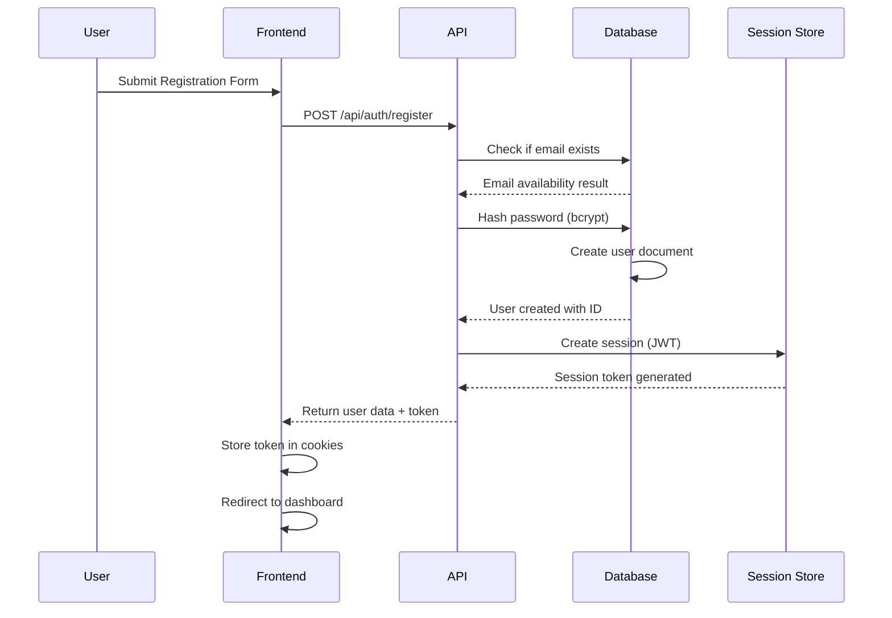
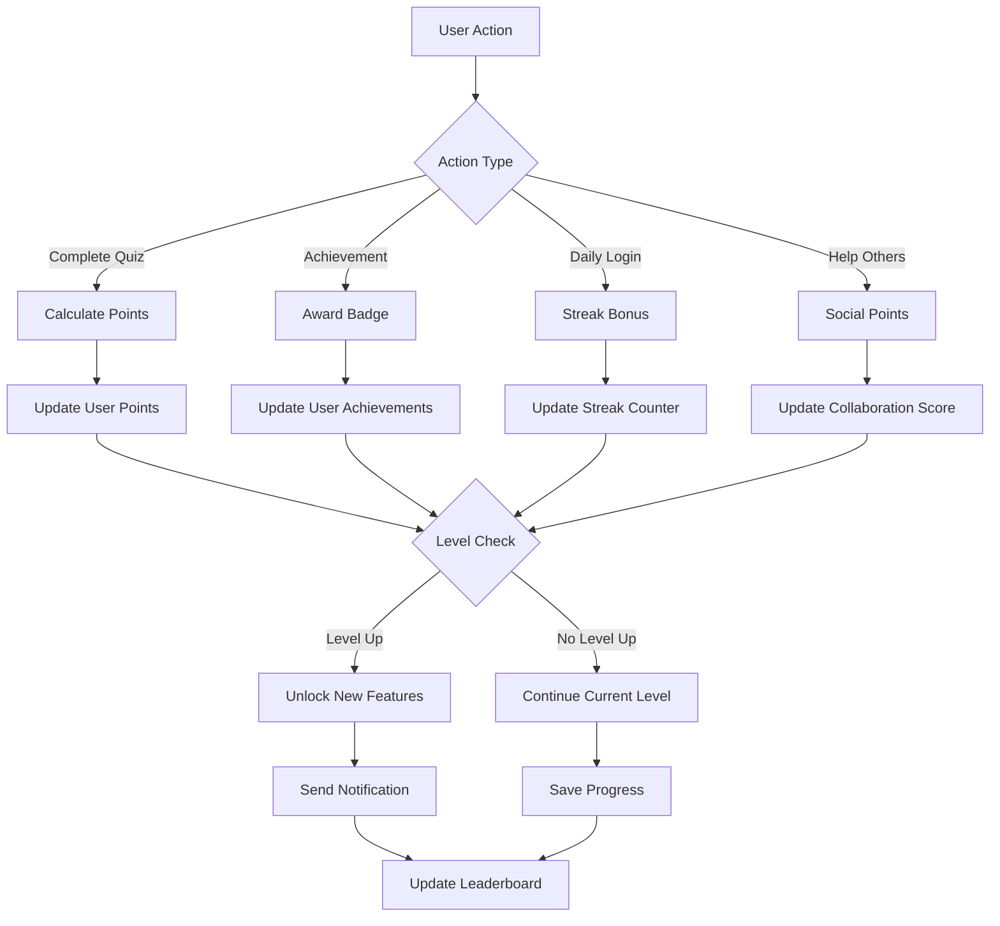

# 🔄 Data Flow & Authentication Guide

## 🎯 Overview

This document explains the complete data flow and authentication system for the QuixPro gamified educational platform, designed specifically for Rwanda's education system.

---

## 🔐 Authentication & Authorization Flow

### **1. User Registration Flow**



### **2. Login Authentication Flow**

```mermaid
sequenceDiagram
    participant U as User
    participant F as Frontend
    participant A as API
    participant D as Database
    participant O as OAuth Provider

    Note over U, F: Email/Password Login
    U->>F: Enter credentials
    F->>A: POST /api/auth/login
    A->>D: Find user by email
    D-->>A: User document
    A->>A: Compare password hash
    alt Password Correct
        A->>S: Generate JWT session
        A->>D: Update last login timestamp
        A-->>F: Return user + token + role
    else Password Incorrect
        A-->>F: Return error
    end

    Note over U, F, O: OAuth Login
    U->>F: Click Google Login
    F->>A: GET /api/auth/google
    A->>O: Redirect to Google OAuth
    O-->>A: Authorization code
    A->>O: Exchange code for tokens
    O-->>A: User profile + tokens
    A->>D: Find or create user
    A->>S: Create session
    A-->>F: Return user + token
```

### **3. Session Management Flow**

```typescript
// Session structure
interface UserSession {
  user: {
    id: string;           // MongoDB ObjectId
    email: string;
    name: string;
    role: 'student' | 'teacher' | 'admin';
    level: string;
    school?: string;
    avatar?: string;
    points: number;
    streak: number;
    preferences: UserPreferences;
  };
  expires: Date;         // Token expiration
  accessToken: string;     // JWT access token
  refreshToken?: string;   // For token refresh
}

// Session middleware
export async function middleware(request: NextRequest) {
  const token = request.cookies.get('auth-token')?.value;
  
  if (!token) {
    return NextResponse.redirect(new URL('/login', request.url));
  }

  try {
    const decoded = jwt.verify(token, process.env.NEXTAUTH_SECRET!) as UserSession;
    
    // Check token expiration
    if (Date.now() > decoded.expires) {
      return NextResponse.redirect(new URL('/login', request.url));
    }

    // Add user to request for downstream use
    request.user = decoded.user;
    
    return NextResponse.next();
  } catch (error) {
    return NextResponse.redirect(new URL('/login', request.url));
  }
}
```

---

## 🎮 Gamified System Data Flow

### **1. Points & Rewards System**



### **2. Gamification Data Models**

```typescript
// User Gamification Profile
interface UserGamification {
  userId: ObjectId;
  points: {
    current: number;           // Current total points
    lifetime: number;         // All-time earned points
    spent: number;            // Points spent on rewards
    monthly: number;          // Points earned this month
  };
  level: {
    current: number;          // Current level (1-100)
    progress: number;         // Progress to next level (0-100%)
    unlockedAt: Date;        // When current level was reached
  };
  streak: {
    current: number;          // Current consecutive days
    longest: number;          // Longest streak ever
    lastActivity: Date;      // Last day of activity
    multiplier: number;        // Points multiplier (1x-5x)
  };
  achievements: {
    unlocked: Achievement[];   // All unlocked achievements
    inProgress: Achievement[]; // Currently working on
    totalPoints: number;      // Points from achievements
  };
  badges: {
    earned: Badge[];         // All earned badges
    featured: Badge[];        // Featured badges display
    rarity: 'common' | 'rare' | 'epic' | 'legendary';
  };
  leaderboard: {
    global: LeaderboardEntry[];
    school: LeaderboardEntry[];
    friends: LeaderboardEntry[];
    rank: {
      overall: number;
      school: number;
      friends: number;
    };
  };
}

// Achievement System
interface Achievement {
  id: string;
  title: string;
  description: string;
  category: 'quiz' | 'streak' | 'social' | 'milestone';
  difficulty: 'bronze' | 'silver' | 'gold' | 'platinum';
  points: number;              // Points awarded
  requirements: {
    type: 'quiz_score' | 'consecutive_days' | 'total_points' | 'social_helps';
    value: number;            // Required value
    condition?: string;        // Additional condition
  };
  rewards: {
    points: number;
    badge: Badge;
    title?: string;           // "Quiz Master", "Helper", etc.
  };
  unlockedAt?: Date;
  progress?: {
    current: number;          // Current progress
    total: number;           // Total required
    percentage: number;       // Progress percentage
  };
}

// Points Calculation Engine
class PointsCalculator {
  static calculateQuizPoints(
    score: number,
    totalQuestions: number,
    timeSpent: number,
    difficulty: 'easy' | 'medium' | 'hard'
  ): number {
    const basePoints = Math.round((score / totalQuestions) * 100);
    const difficultyMultiplier = {
      easy: 1.0,
      medium: 1.5,
      hard: 2.0
    };
    const timeBonus = this.calculateTimeBonus(timeSpent);
    const streakMultiplier = this.getStreakMultiplier();
    
    return Math.round(
      basePoints * 
      difficultyMultiplier[difficulty] * 
      timeBonus * 
      streakMultiplier
    );
  }
  
  static calculateTimeBonus(timeSpent: number): number {
    // Bonus for completing quickly
    if (timeSpent < 60) return 1.2;      // Under 1 minute
    if (timeSpent < 120) return 1.1;     // Under 2 minutes
    if (timeSpent < 300) return 1.0;     // Under 5 minutes
    return 0.9;                             // Over 5 minutes
  }
  
  static getStreakMultiplier(): number {
    const streak = this.getCurrentUserStreak();
    if (streak >= 30) return 2.0;       // Monthly streak
    if (streak >= 14) return 1.5;       // 2-week streak
    if (streak >= 7) return 1.2;         // 1-week streak
    if (streak >= 3) return 1.1;         // 3-day streak
    return 1.0;                           // No streak bonus
  }
}
```

### **3. Real-time Gamification Updates**

```typescript
// WebSocket events for gamification
interface GamificationEvents {
  'points_earned': {
    userId: string;
    points: number;
    source: 'quiz' | 'achievement' | 'streak' | 'social';
    newTotal: number;
  };
  'level_up': {
    userId: string;
    oldLevel: number;
    newLevel: number;
    unlockedFeatures: string[];
  };
  'achievement_unlocked': {
    userId: string;
    achievement: Achievement;
    notification: Notification;
  };
  'streak_updated': {
    userId: string;
    oldStreak: number;
    newStreak: number;
    bonusMultiplier: number;
  };
  'leaderboard_changed': {
    userId: string;
    category: 'global' | 'school' | 'friends';
    oldRank: number;
    newRank: number;
  };
}

// Real-time update handler
export class GamificationManager {
  private io: Server;
  private userSessions: Map<string, UserSession>;
  
  constructor(io: Server) {
    this.io = io;
    this.userSessions = new Map();
  }
  
  handlePointsEarned(userId: string, data: any) {
    // Update database
    this.updateUserPoints(userId, data.points);
    
    // Broadcast to user's sessions
    this.broadcastToUser(userId, 'points_earned', {
      points: data.points,
      newTotal: data.newTotal,
      animation: this.getPointsAnimation(data.points)
    });
    
    // Update leaderboards
    this.updateLeaderboard(userId, 'global');
    this.updateLeaderboard(userId, 'school');
    
    // Check for level up
    this.checkLevelUp(userId);
  }
  
  handleAchievementUnlocked(userId: string, achievement: Achievement) {
    // Update user achievements
    this.addUserAchievement(userId, achievement);
    
    // Send notification
    this.broadcastToUser(userId, 'achievement_unlocked', {
      achievement,
      notification: {
        title: '🏆 Achievement Unlocked!',
        message: achievement.title,
        type: 'success',
        duration: 5000
      }
    });
    
    // Award badge if applicable
    if (achievement.badge) {
      this.awardBadge(userId, achievement.badge);
    }
  }
  
  private async updateUserPoints(userId: string, points: number) {
    await User.updateOne(
      { _id: userId },
      { 
        $inc: { 'gamification.points.current': points },
        $inc: { 'gamification.points.lifetime': points },
        $set: { 'gamification.lastUpdated': new Date() }
      }
    );
  }
}
```

---

## 📊 Data Flow Architecture

### **1. Request Flow Pipeline**

```typescript
// API request pipeline
export function apiHandler(handler: Function) {
  return async (req: NextRequest, res: NextResponse) => {
    try {
      // 1. Authentication check
      const user = await authenticateRequest(req);
      if (!user) {
        return res.status(401).json({ error: 'Unauthorized' });
      }
      
      // 2. Authorization check
      const authorized = await authorizeRequest(req, user);
      if (!authorized) {
        return res.status(403).json({ error: 'Forbidden' });
      }
      
      // 3. Rate limiting
      const rateLimitOk = await checkRateLimit(req, user.id);
      if (!rateLimitOk) {
        return res.status(429).json({ error: 'Too many requests' });
      }
      
      // 4. Input validation
      const validation = validateInput(req);
      if (!validation.valid) {
        return res.status(400).json({ error: validation.errors });
      }
      
      // 5. Business logic
      const result = await handler(req, user, validation.data);
      
      // 6. Response formatting
      return res.status(200).json({
        success: true,
        data: result,
        timestamp: new Date().toISOString()
      });
      
    } catch (error) {
      console.error('API Error:', error);
      return res.status(500).json({ 
        error: 'Internal server error',
        requestId: generateRequestId()
      });
    }
  };
}
```

### **2. Database Transaction Flow**

```typescript
// Transactional data operations
export class DataService {
  async createQuizAttempt(attemptData: QuizAttemptData): Promise<QuizAttempt> {
    const session = await mongoose.startSession();
    
    try {
      await session.withTransaction(async () => {
        // 1. Create quiz attempt
        const attempt = await QuizAttempt.create([attemptData], { session });
        
        // 2. Update user stats
        await User.updateOne(
          { _id: attemptData.userId },
          { 
            $inc: { 'gamification.points.current': attemptData.points },
            $set: { 'lastQuizAttempt': new Date() }
          },
          { session }
        );
        
        // 3. Update quiz analytics
        await QuizAnalytics.updateOne(
          { quizId: attemptData.quizId },
          { 
            $inc: { totalAttempts: 1 },
            $push: { recentScores: attemptData.score }
          },
          { session }
        );
        
        // 4. Check achievements
        await this.checkAchievements(attemptData.userId, attempt, { session });
        
        // 5. Update leaderboards
        await this.updateLeaderboards(attemptData.userId, attemptData.score, { session });
        
      });
      
      return attempt;
    } finally {
      await session.endSession();
    }
  }
}
```

---

## 🔐 Role-Based Access Control

### **Permission Matrix**

```typescript
// Role-based permissions
interface Permissions {
  // Student permissions
  student: {
    quiz: ['read', 'attempt'];
    profile: ['read', 'update:own'];
    dashboard: ['read'];
    chat: ['read', 'write:own'];
  };
  
  // Teacher permissions
  teacher: {
    quiz: ['read', 'create', 'update:own', 'delete:own'];
    profile: ['read', 'update'];
    dashboard: ['read', 'analytics:own'];
    chat: ['read', 'write', 'moderate:own'];
    students: ['read', 'update:class'];
    analytics: ['read:class'];
  };
  
  // Admin permissions
  admin: {
    quiz: ['*']; // All quiz permissions
    profile: ['*']; // All profile permissions
    dashboard: ['*']; // All dashboard permissions
    chat: ['*']; // All chat permissions
    users: ['read', 'update', 'delete'];
    system: ['read', 'update'];
    analytics: ['*']; // All analytics permissions
  };
}

// Authorization middleware
export function checkPermission(
  user: UserSession,
  resource: string,
  action: string
): boolean {
  const userPermissions = Permissions[user.role];
  
  if (!userPermissions) {
    return false;
  }
  
  const resourcePermissions = userPermissions[resource] || [];
  return resourcePermissions.includes('*') || 
         resourcePermissions.includes(action) ||
         (action.startsWith('update:own') && isOwner(user, resource));
}
```

---

## 📱 Client-Side Data Management

### **State Management Flow**

```typescript
// Global state structure
interface AppState {
  auth: {
    user: UserSession | null;
    loading: boolean;
    error: string | null;
  };
  gamification: {
    points: number;
    level: number;
    streak: number;
    achievements: Achievement[];
    leaderboard: LeaderboardEntry[];
    notifications: Notification[];
  };
  ui: {
    theme: 'light' | 'dark' | 'system';
    sidebarOpen: boolean;
    notifications: Notification[];
  };
  data: {
    quizzes: Quiz[];
    attempts: QuizAttempt[];
    profile: UserProfile;
  };
}

// Data fetching hooks
export const useGamification = () => {
  const { data, loading, error } = useQuery({
    queryKey: ['gamification'],
    queryFn: fetchGamificationData,
    staleTime: 5 * 60 * 1000, // 5 minutes
    cacheTime: 10 * 60 * 1000, // 10 minutes
  });
  
  const updatePoints = useMutation({
    mutationFn: (points: number) => updatePoints(points),
    onSuccess: (newPoints) => {
      // Optimistic update
      queryClient.setQueryData(['gamification'], (old: any) => ({
        ...old,
        points: newPoints
      }));
      
      // Show celebration animation
      showPointsAnimation(points);
      
      // Invalidate related queries
      queryClient.invalidateQueries(['leaderboard']);
    }
  });
  
  return {
    data,
    loading,
    error,
    updatePoints: updatePoints.mutate,
    refetch: data?.refetch
  };
};
```

---

## 🔄 Real-time Data Synchronization

### **WebSocket Event System**

```typescript
// Event-driven updates
export class RealtimeManager {
  private connections: Map<string, Socket>;
  private subscriptions: Map<string, Set<string>>;
  
  constructor() {
    this.connections = new Map();
    this.subscriptions = new Map();
  }
  
  handleConnection(socket: Socket) {
    const userId = socket.userId;
    this.connections.set(userId, socket);
    
    // Subscribe to user-specific channels
    socket.join(`user:${userId}`);
    socket.join(`gamification:${userId}`);
    
    // Handle real-time events
    socket.on('subscribe', (channels: string[]) => {
      channels.forEach(channel => {
        if (!this.subscriptions.has(channel)) {
          this.subscriptions.set(channel, new Set());
        }
        this.subscriptions.get(channel)!.add(userId);
        socket.join(channel);
      });
    });
    
    socket.on('unsubscribe', (channels: string[]) => {
      channels.forEach(channel => {
        if (this.subscriptions.has(channel)) {
          this.subscriptions.get(channel)!.delete(userId);
          socket.leave(channel);
        }
      });
    });
  }
  
  broadcastGamificationUpdate(userId: string, event: string, data: any) {
    // Broadcast to user's all connections
    const userSockets = Array.from(this.connections.values())
      .filter(socket => socket.userId === userId);
    
    userSockets.forEach(socket => {
      socket.emit('gamification_update', { event, data });
    });
    
    // Update leaderboard subscribers
    if (event === 'points_earned' || event === 'level_up') {
      this.broadcastToChannel('leaderboard', 'update', {
        userId,
        type: event,
        data
      });
    }
  }
}
```

---

## 🎯 Rwanda-Specific Gamification

### **Cultural Adaptation**

```typescript
// Rwanda-specific gamification elements
interface RwandaGamification {
  culturalBadges: {
    'Umuganda': {          // Community service
      description: 'Help fellow students',
      icon: '🤝',
      points: 50
    };
    'Ikirenzi': {          // Excellence
      description: 'Achieve top scores',
      icon: '⭐',
      points: 100
    };
    'Ubumwe': {            // Knowledge
      description: 'Complete difficult topics',
      icon: '📚',
      points: 75
    };
  };
  
  localLeaderboards: {
    'School Rankings': 'Top students per school';
    'District Champions': 'Best students in each district';
    'National Leaders': 'Top students nationwide';
    'Subject Masters': 'Best per subject area';
  };
  
  educationalLevels: {
    primary: { levels: ['P1', 'P2', 'P3', 'P4', 'P5', 'P6'] };
    lowerSecondary: { levels: ['S1', 'S2', 'S3'] };
    upperSecondary: { levels: ['S4', 'S5', 'S6'] };
  };
}
```

### **Progress Tracking for Rwandan Curriculum**

```typescript
// Curriculum-aligned progress tracking
export class CurriculumTracker {
  trackStudentProgress(userId: string, subject: string, level: string) {
    const curriculum = RWANDA_CURRICULUM[level];
    const subjectTopics = curriculum.subjects[subject];
    
    return {
      currentLevel: level,
      subject: subject,
      topics: subjectTopics.map(topic => ({
        name: topic.name,
        completed: this.checkTopicCompletion(userId, topic.id),
        mastery: this.calculateMastery(userId, topic.id),
        nextRecommended: this.getNextTopic(userId, topic.id)
      })),
      overallProgress: this.calculateSubjectProgress(userId, subject),
      readyForNextLevel: this.checkLevelReadiness(userId, level, subject)
    };
  }
  
  private calculateMastery(userId: string, topicId: string): number {
    // Based on quiz scores, practice time, and retry attempts
    const attempts = this.getTopicAttempts(userId, topicId);
    const averageScore = attempts.reduce((sum, a) => sum + a.score, 0) / attempts.length;
    
    if (averageScore >= 90) return 5;      // Mastered
    if (averageScore >= 75) return 4;      // Excellent
    if (averageScore >= 60) return 3;      // Good
    if (averageScore >= 40) return 2;      // Developing
    return 1;                              // Needs improvement
  }
}
```

---

## 📊 Analytics & Insights

### **Learning Analytics**

```typescript
// Comprehensive analytics system
export class LearningAnalytics {
  generateStudentReport(userId: string): StudentReport {
    const user = await User.findById(userId);
    const attempts = await QuizAttempt.find({ userId });
    const timeSpent = await this.calculateTimeSpent(userId);
    
    return {
      performance: {
        averageScore: this.calculateAverageScore(attempts),
        improvementRate: this.calculateImprovement(attempts),
        strongSubjects: this.identifyStrengths(attempts),
        weakAreas: this.identifyWeaknesses(attempts)
      },
      engagement: {
        totalTimeSpent: timeSpent,
        averageSessionLength: this.calculateSessionLength(attempts),
        preferredStudyTimes: this.getPreferredStudyTimes(attempts),
        streakData: user.gamification.streak
      },
      progress: {
        currentLevel: user.gamification.level.current,
        levelProgress: user.gamification.level.progress,
        estimatedCompletion: this.estimateCompletionDate(userId),
        nextMilestones: this.getNextMilestones(userId)
      },
      recommendations: {
        focusAreas: this.recommendFocusAreas(attempts),
        nextTopics: this.recommendNextTopics(userId),
        studySchedule: this.generateOptimalSchedule(userId)
      }
    };
  }
}
```

---

## 🎉 Summary

This data flow and authentication system provides:

### **✅ Security & Reliability:**
- Multi-provider authentication
- Role-based access control
- Session management
- Rate limiting and validation
- Transactional data operations

### **✅ Gamification Excellence:**
- Points and rewards system
- Achievement and badge system
- Real-time leaderboards
- Streak multipliers
- Rwanda-specific cultural elements

### **✅ Real-time Features:**
- WebSocket communication
- Live gamification updates
- Instant notifications
- Collaborative learning

### **✅ Data Integrity:**
- Transactional database operations
- Optimistic updates
- Error handling and recovery
- Audit trails and logging

### **✅ Rwanda Education Focus:**
- Curriculum-aligned progress tracking
- Local education levels (P1-S6)
- Cultural relevance and sensitivity
- District and national leaderboards

**Ready to build an engaging, culturally-aware, and technically robust educational platform!** 🎓🇷🇼🚀
