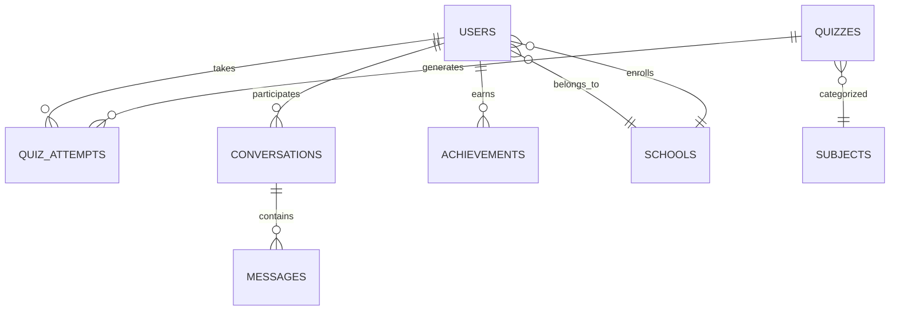

# 🏗️ QuixPro Project Architecture

## 📋 Executive Summary

QuixPro is a comprehensive educational platform designed for the Rwandan education system, featuring interactive quizzes, real-time collaboration, gamification, and advanced analytics. Built with modern web technologies and scalable architecture.

## 🎯 Core Purpose

**Mission**: To provide an engaging, accessible, and effective learning platform for Rwandan students from Primary to Upper Secondary levels, with tools for teachers to create and manage educational content.

## 👥 Target Audience

### **Primary Users**
- **Students (Ages 6-18)**: Primary, Lower Secondary, Upper Secondary
- **Teachers**: Content creators and facilitators
- **School Administrators**: System management and oversight
- **Parents**: Progress monitoring and support

### **Rwanda Education Alignment**
- **Primary Level**: P1-P6 (Ages 6-12)
- **Lower Secondary**: S1-S3 (Ages 13-15) 
- **Upper Secondary**: S4-S6 (Ages 16-18)
- **Subjects**: Mathematics, Science, English, Kinyarwanda, Social Studies

## 🛠️ Technology Architecture

### **Frontend Stack**
```
┌─────────────────────────────────────────────────────────────┐
│                    PRESENTATION LAYER                   │
├─────────────────────────────────────────────────────┤
│ React 18 + TypeScript + Tailwind CSS          │
│ - Component-based architecture                 │
│ - Server-side rendering (SSR)               │
│ - Responsive design (Mobile-first)             │
├─────────────────────────────────────────────────────┤
│                    STATE MANAGEMENT                   │
│ React Context + Zustand + TanStack Query        │
│ - Global state (user, theme, notifications)   │
│ - Server state (API caching, synchronization)   │
│ - Optimistic updates                        │
├─────────────────────────────────────────────────────┤
│                    UI COMPONENTS                     │
│ Shadcn/ui + Radix UI + Lucide Icons        │
│ - Accessible components                      │
│ - Design system consistency                   │
│ - Dark/light theme support                  │
└─────────────────────────────────────────────────────┘
```

### **Backend Stack**
```
┌─────────────────────────────────────────────────────────────┐
│                    API LAYER                        │
│ Next.js 14 App Router + API Routes            │
│ - RESTful endpoints                         │
│ - Middleware for authentication                │
│ - Route protection and validation             │
├─────────────────────────────────────────────────────┤
│                    BUSINESS LOGIC                   │
│ Custom services + Domain logic                 │
│ - Quiz engine                             │
│ - Gamification system                      │
│ - Analytics processing                     │
│ - Notification system                     │
├─────────────────────────────────────────────────────┤
│                    DATA LAYER                        │
│ MongoDB + Mongoose + Prisma                 │
│ - Document database                        │
│ - Schema validation                       │
│ - Query optimization                     │
│ - Data relationships                    │
├─────────────────────────────────────────────────────┤
│                    AUTHENTICATION                    │
│ NextAuth.js + JWT + OAuth                 │
│ - Multi-provider support                   │
│ - Role-based access control              │
│ - Session management                    │
├─────────────────────────────────────────────────────┤
│                    REAL-TIME                         │
│ Socket.io + Firebase + WebRTC               │
│ - Live chat                             │
│ - Video calls                           │
│ - Collaborative tools                    │
└─────────────────────────────────────────────────────┘
```

## 🎨 Feature Architecture

### **🔐 Authentication & Authorization**
```typescript
// Multi-provider authentication system
interface AuthSystem {
  providers: {
    email: EmailProvider;
    google: GoogleProvider;
    microsoft: MicrosoftProvider;
    facebook: FacebookProvider;
  };
  features: {
    mfa: boolean;
    sso: boolean;
    roleBasedAccess: boolean;
    sessionManagement: boolean;
    passwordReset: boolean;
    emailVerification: boolean;
  };
}
```

### **📊 Analytics & Intelligence**
```typescript
// Learning analytics engine
interface AnalyticsSystem {
  modules: {
    progressTracking: ProgressTracker;
    performanceMetrics: PerformanceAnalyzer;
    learningPaths: PathGenerator;
    predictiveAnalytics: PredictionEngine;
    engagementMetrics: EngagementTracker;
  };
  insights: {
    strugglingAreas: string[];
    recommendedTopics: string[];
    optimalStudyTime: TimeAnalysis;
    socialLearningPatterns: SocialMetrics;
  };
}
```

### **🎮 Gamification Engine**
```typescript
// Comprehensive gamification system
interface GamificationSystem {
  mechanics: {
    points: PointsSystem;
    badges: BadgeEngine;
    leaderboards: LeaderboardManager;
    streaks: StreakTracker;
    levels: LevelProgression;
    achievements: AchievementSystem;
    challenges: ChallengeManager;
  };
  rewards: {
    virtual: VirtualRewards;
    physical: PhysicalRewards;
    social: SocialRecognition;
  };
}
```

### **💬 Communication System**
```typescript
// Real-time communication platform
interface CommunicationSystem {
  channels: {
    directMessages: DirectChat;
    groupChats: GroupChat;
    videoCalls: VideoConference;
    screenShare: ScreenSharing;
    fileSharing: FileTransfer;
  };
  features: {
    messageReactions: ReactionSystem;
    typingIndicators: TypingStatus;
    onlinePresence: PresenceManager;
    messageSearch: SearchEngine;
    moderationTools: ContentModeration;
  };
}
```

## 🗃️ Database Architecture

### **Schema Design**
```typescript
// Core data models
interface DatabaseSchema {
  users: UserCollection;
  quizzes: QuizCollection;
  attempts: AttemptCollection;
  schools: SchoolCollection;
  subjects: SubjectCollection;
  achievements: AchievementCollection;
  conversations: ConversationCollection;
  messages: MessageCollection;
  notifications: NotificationCollection;
  analytics: AnalyticsCollection;
}
```

### **Relationships**


## 🎨 UI/UX Architecture

### **Design System**
```typescript
// Component library structure
interface DesignSystem {
  foundation: {
    colors: ColorPalette;
    typography: FontSystem;
    spacing: SpacingScale;
    borderRadius: BorderRadiusScale;
    shadows: ShadowSystem;
  };
  components: {
    primitives: Button, Input, Card, Modal;
    composites: DataTable, Form, Navigation;
    layouts: Dashboard, Auth, Quiz;
  };
  themes: {
    light: LightTheme;
    dark: DarkTheme;
    system: SystemTheme;
  };
}
```

### **Responsive Design**
```typescript
// Breakpoint system
interface ResponsiveDesign {
  breakpoints: {
    mobile: '320px - 768px';
    tablet: '768px - 1024px';
    desktop: '1024px - 1440px';
    wide: '1440px+';
  };
  strategies: {
    mobileFirst: boolean;
    progressiveEnhancement: boolean;
    gracefulDegradation: boolean;
  };
}
```

## 🚀 Performance Architecture

### **Optimization Strategies**
```typescript
// Performance optimization
interface PerformanceOptimization {
  frontend: {
    codeSplitting: DynamicImports;
    lazyLoading: ComponentLazyLoading;
    caching: ServiceWorker;
    bundleOptimization: TreeShaking;
    imageOptimization: WebP/AVIF;
  };
  backend: {
    queryOptimization: IndexingStrategy;
    caching: RedisLayer;
    connectionPooling: DatabasePool;
    compression: GzipBrotli;
    cdn: CloudflareCDN;
  };
  monitoring: {
    webVitals: CoreMetrics;
    errorTracking: SentryIntegration;
    performanceMonitoring: APMTools;
    userAnalytics: CustomAnalytics;
  };
}
```

## 🔒 Security Architecture

### **Security Layers**
```typescript
// Comprehensive security model
interface SecurityArchitecture {
  authentication: {
    passwordHashing: bcrypt;
    tokenGeneration: JWT;
    sessionManagement: SecureCookies;
    multiFactorAuth: TOTP;
    oauthIntegration: OpenIDConnect;
  };
  authorization: {
    roleBasedAccess: RBAC;
    permissionSystem: GranularPermissions;
    apiRateLimiting: RateLimiter;
    inputValidation: ZodSchemas;
  };
  dataProtection: {
    encryptionAtRest: AESEncryption;
    encryptionInTransit: HTTPS;
    dataAnonymization: PrivacyProtection;
    gdprCompliance: DataRights;
  };
  infrastructure: {
    firewallSecurity: WAFRules;
    ddosProtection: Cloudflare;
    vulnerabilityScanning: AutomatedScans;
    securityHeaders: HSTS/CSP;
  };
}
```

## 🌐 Deployment Architecture

### **Infrastructure**
```typescript
// Production deployment strategy
interface DeploymentArchitecture {
  hosting: {
    provider: 'Vercel' | 'Netlify' | 'AWS';
    regions: ['US-East', 'EU-West', 'Africa'];
    cdn: 'Cloudflare' | 'AWS CloudFront';
  };
  database: {
    provider: 'MongoDB Atlas' | 'AWS DocumentDB';
    replication: MultiRegion;
    backup: AutomatedBackups;
    monitoring: PerformanceMetrics;
  };
  scaling: {
    autoScaling: HorizontalScaling;
    loadBalancing: ApplicationLoadBalancer;
    caching: RedisCluster;
    queueSystem: MessageQueue;
  };
}
```

### **CI/CD Pipeline**
```yaml
# GitHub Actions workflow
name: QuixPro CI/CD
on:
  push:
    branches: [main, develop]
  pull_request:
    branches: [main]

jobs:
  test:
    runs-on: ubuntu-latest
    steps:
      - uses: actions/checkout@v3
      - uses: actions/setup-node@v3
      - run: npm ci
      - run: npm run test
      - run: npm run lint
      - run: npm run type-check
  
  deploy:
    needs: test
    runs-on: ubuntu-latest
    steps:
      - uses: actions/checkout@v3
      - name: Deploy to Vercel
        uses: amondnet/vercel-action@v20
        with:
          vercel-token: ${{ secrets.VERCEL_TOKEN }}
          vercel-org-id: ${{ secrets.ORG_ID }}
          vercel-project-id: ${{ secrets.PROJECT_ID }}
```

## 📈 Scalability Architecture

### **Growth Planning**
```typescript
// Scalability considerations
interface ScalabilityPlan {
  userGrowth: {
    currentUsers: 1000;
    targetUsers: 100000;
    timeframe: '12 months';
    growthRate: 100; // 100x growth
  };
  technicalScaling: {
    databaseSharding: boolean;
    microservices: boolean;
    loadBalancing: boolean;
    cachingStrategy: 'distributed';
    cdnDistribution: 'global';
  };
  resourceScaling: {
    computeScaling: 'auto';
    storageScaling: 'elastic';
    bandwidthScaling: 'unlimited';
    monitoringAlerts: 'real-time';
  };
}
```

## 🎯 Success Metrics

### **Technical KPIs**
- **Performance**: Page load < 2s, Lighthouse > 90
- **Reliability**: 99.9% uptime, < 0.1% error rate
- **Scalability**: Support 100K concurrent users
- **Security**: Zero critical vulnerabilities
- **Code Quality**: 80%+ test coverage, zero technical debt

### **Business KPIs**
- **User Engagement**: 80%+ daily active rate
- **Learning Outcomes**: 75%+ quiz completion
- **Retention**: 60%+ monthly retention
- **Growth**: 25%+ month-over-month growth
- **Satisfaction**: 4.5+ star rating

## 🔄 Future Roadmap

### **Phase 1: Foundation (Months 1-3)**
- Core authentication system
- Basic quiz functionality
- User dashboard
- MongoDB integration

### **Phase 2: Enhancement (Months 4-6)**
- Real-time chat system
- Advanced analytics
- Gamification features
- Mobile responsiveness

### **Phase 3: Expansion (Months 7-12)**
- Video calling capabilities
- AI-powered recommendations
- Advanced reporting
- Multi-language support

### **Phase 4: Scale (Months 13-18)**
- Microservices architecture
- Machine learning integration
- Global deployment
- Enterprise features

---

## 🚀 Architecture Summary

This architecture provides:
- **Scalability**: Built for growth from 1K to 100K+ users
- **Maintainability**: Clean code structure and comprehensive documentation
- **Security**: Enterprise-grade security measures
- **Performance**: Optimized for speed and user experience
- **Flexibility**: Modular design for easy feature additions
- **Accessibility**: WCAG 2.1 AA compliance
- **Rwanda Focus**: Tailored for local education system

**Ready to build the future of education in Rwanda! 🎓🇷🇼**
